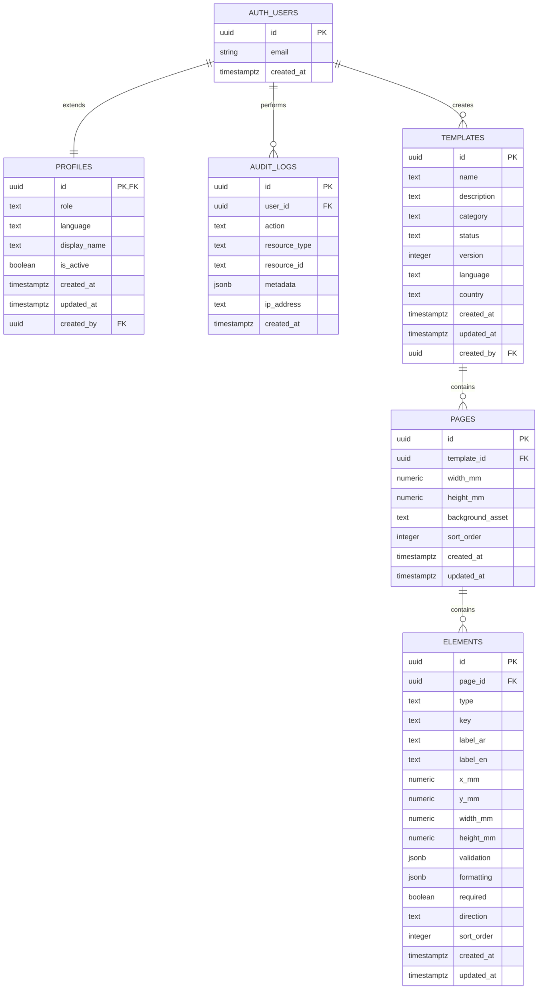

# FormCraft Database Schema - Entity Relationship Diagram

## Overview

The FormCraft database consists of 5 main tables with Row-Level Security (RLS) policies enabled on all tables.

## Tables

### 1. profiles
**Purpose**: Extends Supabase auth.users with role-based access control

| Column | Type | Constraints | Description |
|--------|------|-------------|-------------|
| id | UUID | PK, FK → auth.users(id) | User ID from Supabase Auth |
| role | TEXT | NOT NULL, DEFAULT 'viewer' | admin, designer, operator, viewer |
| language | TEXT | NOT NULL, DEFAULT 'ar' | ar, en |
| display_name | TEXT | NULLABLE | User's display name |
| is_active | BOOLEAN | NOT NULL, DEFAULT true | Account active status |
| created_at | TIMESTAMPTZ | NOT NULL, DEFAULT now() | Profile creation timestamp |
| updated_at | TIMESTAMPTZ | NOT NULL, DEFAULT now() | Last update timestamp |
| created_by | UUID | NULLABLE, FK → auth.users(id) | Admin who created this profile |

**Triggers**:
- `on_auth_user_created`: Auto-creates profile when new user signs up
- `profiles_updated_at`: Auto-updates updated_at on row changes

---

### 2. audit_logs
**Purpose**: Track all user actions for compliance and debugging

| Column | Type | Constraints | Description |
|--------|------|-------------|-------------|
| id | UUID | PK, DEFAULT gen_random_uuid() | Unique log entry ID |
| user_id | UUID | NOT NULL, FK → auth.users(id) | User who performed action |
| action | TEXT | NOT NULL | Action type (create, update, delete, etc.) |
| resource_type | TEXT | NOT NULL | Resource affected (template, page, element) |
| resource_id | TEXT | NULLABLE | ID of affected resource |
| metadata | JSONB | DEFAULT '{}' | Additional context data |
| ip_address | TEXT | NULLABLE | User's IP address |
| created_at | TIMESTAMPTZ | NOT NULL, DEFAULT now() | When action occurred |

**Indexes**:
- `idx_audit_logs_user`: On user_id
- `idx_audit_logs_action`: On action
- `idx_audit_logs_created`: On created_at DESC

---

### 3. templates
**Purpose**: Form templates with versioning and multi-language support

| Column | Type | Constraints | Description |
|--------|------|-------------|-------------|
| id | UUID | PK, DEFAULT gen_random_uuid() | Unique template ID |
| name | TEXT | NOT NULL | Template name |
| description | TEXT | DEFAULT '' | Template description |
| category | TEXT | NOT NULL, DEFAULT 'general' | Template category |
| status | TEXT | NOT NULL, DEFAULT 'draft' | draft, published |
| version | INTEGER | NOT NULL, DEFAULT 1 | Template version number |
| language | TEXT | NOT NULL, DEFAULT 'ar' | ar, en |
| country | TEXT | NOT NULL, DEFAULT 'EG' | EG, SA, AE |
| created_at | TIMESTAMPTZ | NOT NULL, DEFAULT now() | Creation timestamp |
| updated_at | TIMESTAMPTZ | NOT NULL, DEFAULT now() | Last update timestamp |
| created_by | UUID | NOT NULL, FK → auth.users(id) | Designer who created template |

**Indexes**:
- `idx_templates_status`: On status
- `idx_templates_created_by`: On created_by
- `idx_templates_updated`: On updated_at DESC

**Triggers**:
- `templates_updated_at`: Auto-updates updated_at on row changes

---

### 4. pages
**Purpose**: Individual pages within a template (A4 size configurable)

| Column | Type | Constraints | Description |
|--------|------|-------------|-------------|
| id | UUID | PK, DEFAULT gen_random_uuid() | Unique page ID |
| template_id | UUID | NOT NULL, FK → templates(id) ON DELETE CASCADE | Parent template |
| width_mm | NUMERIC(7,2) | NOT NULL, DEFAULT 210 | Page width in millimeters |
| height_mm | NUMERIC(7,2) | NOT NULL, DEFAULT 297 | Page height in millimeters (A4 default) |
| background_asset | TEXT | NULLABLE | URL to background image/PDF |
| sort_order | INTEGER | NOT NULL, DEFAULT 0 | Page order within template |
| created_at | TIMESTAMPTZ | NOT NULL, DEFAULT now() | Creation timestamp |
| updated_at | TIMESTAMPTZ | NOT NULL, DEFAULT now() | Last update timestamp |

**Indexes**:
- `idx_pages_template`: On template_id

**Triggers**:
- `pages_updated_at`: Auto-updates updated_at on row changes

**Cascade**: Deleting a template deletes all its pages

---

### 5. elements
**Purpose**: Form elements (fields) positioned on pages

| Column | Type | Constraints | Description |
|--------|------|-------------|-------------|
| id | UUID | PK, DEFAULT gen_random_uuid() | Unique element ID |
| page_id | UUID | NOT NULL, FK → pages(id) ON DELETE CASCADE | Parent page |
| type | TEXT | NOT NULL | text, number, date, currency, dropdown, radio, checkbox, image, qr, barcode |
| key | TEXT | NOT NULL | Unique field key for data binding |
| label_ar | TEXT | DEFAULT '' | Arabic label |
| label_en | TEXT | DEFAULT '' | English label |
| x_mm | NUMERIC(7,2) | NOT NULL, DEFAULT 0 | X position in millimeters |
| y_mm | NUMERIC(7,2) | NOT NULL, DEFAULT 0 | Y position in millimeters |
| width_mm | NUMERIC(7,2) | NOT NULL, DEFAULT 50 | Element width in millimeters |
| height_mm | NUMERIC(7,2) | NOT NULL, DEFAULT 10 | Element height in millimeters |
| validation | JSONB | DEFAULT '{}' | Validation rules (e.g., Egypt phone validator) |
| formatting | JSONB | DEFAULT '{}' | Formatting rules (e.g., currency format) |
| required | BOOLEAN | NOT NULL, DEFAULT false | Is field required? |
| direction | TEXT | NOT NULL, DEFAULT 'auto' | rtl, ltr, auto |
| sort_order | INTEGER | NOT NULL, DEFAULT 0 | Element order within page |
| created_at | TIMESTAMPTZ | NOT NULL, DEFAULT now() | Creation timestamp |
| updated_at | TIMESTAMPTZ | NOT NULL, DEFAULT now() | Last update timestamp |

**Indexes**:
- `idx_elements_page`: On page_id

**Triggers**:
- `elements_updated_at`: Auto-updates updated_at on row changes

**Cascade**: Deleting a page deletes all its elements

---

## Relationships

```
auth.users (Supabase Auth)
    ↓ 1:1
profiles (role, language, display_name)
    ↓ 1:N
templates (name, status, version, country)
    ↓ 1:N
pages (width_mm, height_mm, sort_order)
    ↓ 1:N
elements (type, key, x_mm, y_mm, validation)

auth.users
    ↓ 1:N
audit_logs (action, resource_type, metadata)
```

## Visual ERD (Mermaid)



## Row-Level Security (RLS) Policies

### profiles
- **admin_full_profiles**: Admins can do everything
- **own_profile_select**: Users can view their own profile
- **own_profile_update**: Users can update their own profile

### templates
- **admin_all_templates**: Admins have full access
- **designer_select_templates**: Designers see their own + published templates
- **designer_insert_templates**: Designers can create templates (must be owner)
- **designer_update_templates**: Designers can update their own draft templates
- **designer_delete_templates**: Designers can delete their own draft templates
- **readonly_published_templates**: Operators/viewers can view published templates

### pages
- **admin_all_pages**: Admins have full access
- **designer_pages**: Designers can manage pages in their own draft templates
- **read_published_pages**: All users can view pages in published templates

### elements
- **admin_all_elements**: Admins have full access
- **designer_elements**: Designers can manage elements in their own draft templates
- **read_published_elements**: All users can view elements in published templates

### audit_logs
- **admin_audit_logs**: Only admins can view audit logs
- **service_insert_audit**: Backend service role can always insert logs

## Database Functions

### handle_new_user()
**Trigger**: `on_auth_user_created` (AFTER INSERT on auth.users)
**Purpose**: Automatically creates a profile with default role='viewer' when a new user signs up

### update_updated_at()
**Triggers**: 
- `profiles_updated_at` (BEFORE UPDATE on profiles)
- `templates_updated_at` (BEFORE UPDATE on templates)
- `pages_updated_at` (BEFORE UPDATE on pages)
- `elements_updated_at` (BEFORE UPDATE on elements)

**Purpose**: Automatically updates the `updated_at` timestamp on row modifications

## Data Flow Example

1. **User Registration**:
   - User signs up via Supabase Auth → `auth.users` row created
   - Trigger `on_auth_user_created` fires → `profiles` row created with role='viewer'
   - Admin manually updates profile role to 'designer' or 'admin'

2. **Template Creation**:
   - Designer creates template → `templates` row inserted
   - Designer adds pages → `pages` rows inserted with template_id FK
   - Designer adds elements to pages → `elements` rows inserted with page_id FK
   - All actions logged to `audit_logs`

3. **Template Publishing**:
   - Designer updates template status to 'published'
   - RLS policies now allow operators/viewers to read template + pages + elements
   - Draft templates remain private to creator + admins

4. **Cascade Deletion**:
   - Delete template → All pages deleted → All elements deleted
   - Delete page → All elements on that page deleted
   - Delete user → Profile deleted (but templates remain with created_by FK)

## Migration Files

All migrations are located in `/media/yasser/Work/Projects/formcraft-backend/supabase/migrations/`:

1. `001_create_profiles.sql` - Profiles table + triggers
2. `002_create_audit_logs.sql` - Audit logs table + indexes
3. `003_create_templates.sql` - Templates table + indexes + trigger
4. `004_create_pages.sql` - Pages table + indexes + trigger
5. `005_create_elements.sql` - Elements table + indexes + trigger
6. `006_rls_policies.sql` - All RLS policies for all tables

## Supabase Cloud Connection

- **Project**: FormCraft Project (eu-west-1)
- **URL**: https://thwjbagnrcasioiymlsi.supabase.co
- **Tables**: 5 (profiles, audit_logs, templates, pages, elements)
- **RLS**: Enabled on all tables
- **Migrations**: 6 applied via Supabase MCP
